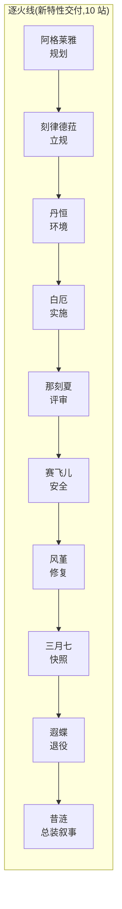
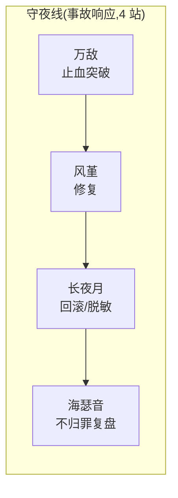

# 翁法罗斯 Skill 套件(Amphoreus Skill Suite)

以《崩坏:星穹铁道》翁法罗斯篇十三位角色为人格外壳的 **13 张工程方法卡 + 1 个总路由**,面向 Claude Code / Cursor 的 `.claude/skills` 生态。每张卡 = 一套可执行的工程方法论(SKILL.md 行为契约)+ 一册台词与背景参考(persona.md,语音逐字对齐游戏知识库)。

<p align="center">
  
  
</p>
<p align="center"><b>amphoreus 总路由</b> —— 开拓者「创世的著者」<br>按任务深度、角色适配、流水线与风格预算分发到 13 张卡,不混声、不代演。</p>

---

## 卡牌画廊 × 方法论

<table>
<tr>
<td align="center"><br><b>阿格莱雅</b>「黄金的织者」<br><code>amphoreus-aglaea</code><br>织造法:项目规划、排期、取舍与里程碑</td>
<td align="center"><br><b>刻律德菈</b>「执棋的君主」<br><code>amphoreus-cerydra</code><br>立法三读:有证据、有成本、可评审、可撤销的工程规则</td>
<td align="center"><br><b>丹恒</b>「掣地的伏龙」<br><code>amphoreus-terrae</code><br>地基法:可验证环境、CI 地基、依赖基座、可逆迁移</td>
<td align="center"><br><b>白厄</b>「负火的囚徒」<br><code>amphoreus-phainon</code><br>推石法:大型重构与批量迁移,可计数、可回滚</td>
</tr>
<tr>
<td align="center"><br><b>那刻夏</b>「殁世的学士」<br><code>amphoreus-anaxa</code><br>五问法+删除测试:代码/设计/论证评审,可执行的否决</td>
<td align="center"><br><b>赛飞儿</b>「捷足的羁客」<br><code>amphoreus-cipher</code><br>行窃三则:授权内对抗测试、边界用例、私密漏洞报告</td>
<td align="center"><br><b>风堇</b>「摇光的医师」<br><code>amphoreus-hyacine</code><br>双处方:bug 诊断修复、依赖故障、维护债清理</td>
<td align="center"><br><b>三月七 / 长夜月</b>「隐秘的陌客」<br><code>amphoreus-march7th</code><br>快照与守夜:事实工作快照;有界备份、回滚、脱敏、清理</td>
</tr>
<tr>
<td align="center"><br><b>遐蝶</b>「死荫的侍女」<br><code>amphoreus-castorice</code><br>告别四步:影响先行的 API/依赖/数据/项目退役</td>
<td align="center"><br><b>昔涟</b>「无瑕的真我」<br><code>amphoreus-cyrene</code><br>如我所书法:项目记忆、阶段叙事、发布说明、终版总装(逐字不改写)</td>
<td align="center"><br><b>万敌</b>「亡国的王储」<br><code>amphoreus-mydei</code><br>先让十步法:硬 bug、性能瓶颈、死锁的单假设有界突破</td>
<td align="center"><br><b>海瑟音</b>「奏浪的剑骑」<br><code>amphoreus-hysilens</code><br>歌集复盘法+无路引航式:不归罪复盘、痛苦取舍导航</td>
</tr>
<tr>
<td align="center"><br><b>缇宝</b>「命运的三子」<br><code>amphoreus-tribbie</code><br>三声部讲解法:面向新手/同行/专家的技术讲解与翻译</td>
<td align="center" colspan="3"><i>立绘:B 站《崩坏:星穹铁道》Wiki「<a href="https://wiki.biligame.com/sr/%E9%80%90%E7%81%AB%E8%80%85%E7%9A%84%E5%91%BD%E8%B7%AF.exe">逐火者的命路.exe</a>」页面之「逐火者的命录」系列卡面。</i></td>
</tr>
</table>

## 两条流水线





角色缺席时按家族缺席合同报告 `module_unavailable: amphoreus-<hero>` 并保留移交事实包——不代演、不冒充。

## 质量与验收

全家族分四波交付,每波经独立验收核查(多代理盲评 + 交叉复核 + 批判员),关键数据:

| 项 | 结果 |
|---|---|
| 静态校验 | `validate.py --wave all` PASS:卡 13/13、路由清单 17/17、评测 13 卷 65 场景、UTF-8/LF |
| 行为评测 | 每卡 5 题冻结场景,13 卡全部 60/60(含失败重跑留痕:昔涟 C-03 首跑真失败原样入册后重跑闭合) |
| 台词保真 | 语音总账 182 条,逐字对齐游戏知识库(MCP 检索复算),引文字符级冻结检查入 validator |
| 端到端终验 | 逐火线 10 站、守夜线 4 站各演练一次,独立评审 CONFIRMED |
| 事后勘误 | L1 海瑟音缺席断言→运行时条件式(五题重跑 60/60×5 + 三分支探针,双评审 CONFIRMED);L2 旧目录归档后清理;L3 超时审计线核销 |

全程「失败原样入册、不覆盖不美化」;完整证据链(誊本、哈希账、回滚沙箱、双打包)在本地交付树,仓库内收录各波验收单与终验报告(见 `docs/`)。

## 安装与使用

1. 把 `skills/` 下 14 个目录整体拷入 `~/.claude/skills/`(Windows:`C:\Users\<你>\.claude\skills\`)。
2. 校验部署:

```bash
python ~/.claude/skills/amphoreus/scripts/validate.py --root ~/.claude/skills --wave all
```

3. 使用:在 Claude Code / Cursor 里直接点名(如「用 amphoreus-mydei 帮我追这个死锁」),或呼叫 `amphoreus` 总路由由它分发;角色只在≤15% 的风格预算内说话,严肃场景(报错、不可逆操作)自动静音。

## 仓库结构

```
├── README.md
├── assets/cards/          # 15 张卡面(400px,来源见下方声明)
├── skills/                # 14 目录 43 文件 = 总路由 + 13 卡(生产验收态)
│   ├── amphoreus/         # 路由 SKILL + common.md + evals/(13 卷)+ scripts/validate.py
│   └── amphoreus-<hero>/  # 各卡 SKILL.md + persona.md
└── docs/                  # 波1–4 验收单、十三卡终验报告、波4 VERIFICATION、总报告、设计分册
```

## 声明

- 本仓库为个人研究/学习用途的同人衍生内容。《崩坏:星穹铁道》及全部角色、立绘、台词素材版权归米哈游(HoYoverse)所有。
- 卡面图片抓取自 [B 站游戏 Wiki](https://wiki.biligame.com/sr/) 对应页面;角色台词经由公开 Wiki 语料逐字核对。
- 如有侵权请联系删除。
