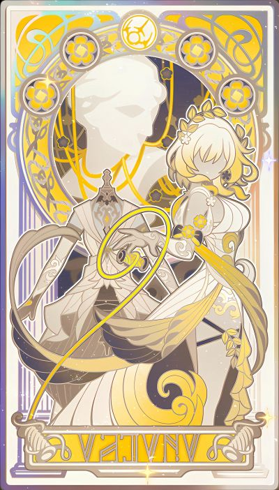
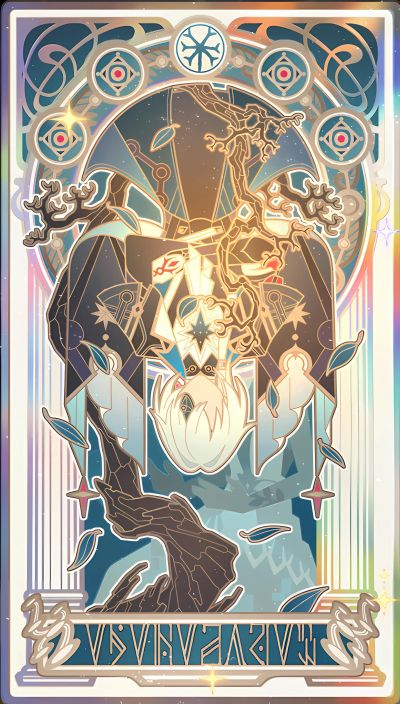
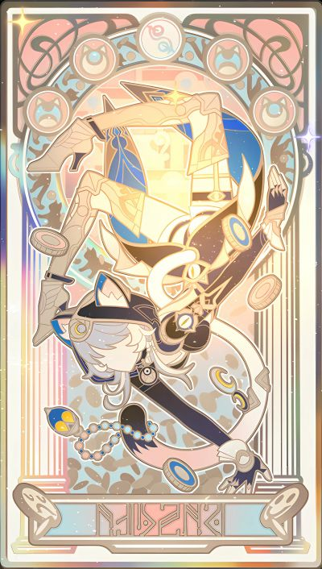
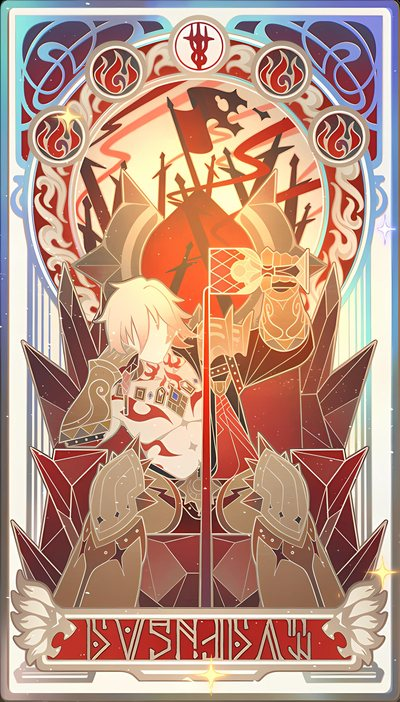

<div align="center">

# 翁法罗斯 Skill 套件

**Amphoreus Skill Suite** — 以《崩坏:星穹铁道》翁法罗斯篇十三位角色为人格外壳的
**13 张工程方法卡 + 1 个总路由**,为 Claude Code / Cursor 的 `.claude/skills` 生态而作。


<br>

**[在线介绍页 →](https://xi-kari.github.io/amphoreus-skill-suite/)**


<sub>卡面:「逐火者的命录」系列 · 取自 <a href="https://wiki.biligame.com/sr/%E9%80%90%E7%81%AB%E8%80%85%E7%9A%84%E5%91%BD%E8%B7%AF.exe">B 站星穹铁道 Wiki</a> · 版权归米哈游所有</sub>

</div>

---

## 这是什么

每张卡不是聊天人设,而是**一套可执行的工程方法论**:

- **`SKILL.md`** — 行为契约:方法步骤、话术模板、输出格式、边界与禁区、缺席移交条款,静态可校验;
- **`persona.md`** — 台词与背景参考库:语音条目逐字对齐游戏公开语料(知识库检索复算,字符级冻结检查);
- **风格税 ≤ 15%** — 角色只在极小预算内说话;报错、不可逆操作等严肃场景**自动静音**,方法照常执行;
- **缺席合同** — 流水线上某卡未部署时,报告 `module_unavailable: amphoreus-<hero>` 并保留移交事实包,不代演、不冒充。

## 快速开始

```bash
# 1. 把 skills/ 下 14 个目录拷入你的技能根
cp -r skills/* ~/.claude/skills/          # Windows: C:\Users\<你>\.claude\skills\

# 2. 校验部署(应输出 PASS,cards=13/13)
python ~/.claude/skills/amphoreus/scripts/validate.py --root ~/.claude/skills --wave all
```

使用:在 Claude Code / Cursor 里直接点名(「用 `amphoreus-mydei` 帮我追这个死锁」),或呼叫 `amphoreus` 总路由,由它按任务深度、角色适配、流水线与风格预算分发。

## 十三卡画廊

<table>
<tr>
<td align="center" width="25%"><br><b>阿格莱雅</b> · <sub>黄金的织者</sub><br><code>amphoreus-aglaea</code><br><sub>织造法 —— 项目规划 / 排期 / 取舍 / 里程碑</sub></td>
<td align="center" width="25%"><br><b>刻律德菈</b> · <sub>执棋的君主</sub><br><code>amphoreus-cerydra</code><br><sub>立法三读 —— 有证据、有成本、可评审、可撤销的工程规则</sub></td>
<td align="center" width="25%"><br><b>丹恒</b> · <sub>掣地的伏龙</sub><br><code>amphoreus-terrae</code><br><sub>地基法 —— 可验证环境 / CI 地基 / 可逆迁移</sub></td>
<td align="center" width="25%"><br><b>白厄</b> · <sub>负火的囚徒</sub><br><code>amphoreus-phainon</code><br><sub>推石法 —— 大型重构与批量迁移,可计数、可回滚</sub></td>
</tr>
<tr>
<td align="center"><br><b>那刻夏</b> · <sub>殁世的学士</sub><br><code>amphoreus-anaxa</code><br><sub>五问法 + 删除测试 —— 代码 / 设计 / 论证评审</sub></td>
<td align="center"><br><b>赛飞儿</b> · <sub>捷足的羁客</sub><br><code>amphoreus-cipher</code><br><sub>行窃三则 —— 授权内对抗测试 / 边界用例 / 私密漏洞报告</sub></td>
<td align="center"><br><b>风堇</b> · <sub>摇光的医师</sub><br><code>amphoreus-hyacine</code><br><sub>双处方 —— bug 诊断修复 / 依赖故障 / 维护债</sub></td>
<td align="center"><br><b>三月七 / 长夜月</b> · <sub>隐秘的陌客</sub><br><code>amphoreus-march7th</code><br><sub>快照与守夜 —— 事实快照;有界备份 / 回滚 / 脱敏</sub></td>
</tr>
<tr>
<td align="center"><br><b>遐蝶</b> · <sub>死荫的侍女</sub><br><code>amphoreus-castorice</code><br><sub>告别四步 —— 影响先行的 API / 依赖 / 项目退役</sub></td>
<td align="center"><br><b>昔涟</b> · <sub>无瑕的真我</sub><br><code>amphoreus-cyrene</code><br><sub>如我所书法 —— 项目记忆 / 阶段叙事 / 终版总装,逐字不改写</sub></td>
<td align="center"><br><b>万敌</b> · <sub>亡国的王储</sub><br><code>amphoreus-mydei</code><br><sub>先让十步法 —— 硬 bug / 性能瓶颈 / 死锁的有界突破</sub></td>
<td align="center"><br><b>海瑟音</b> · <sub>奏浪的剑骑</sub><br><code>amphoreus-hysilens</code><br><sub>歌集复盘法 + 无路引航式 —— 不归罪复盘 / 痛苦取舍导航</sub></td>
</tr>
<tr>
<td align="center"><br><b>缇宝</b> · <sub>命运的三子</sub><br><code>amphoreus-tribbie</code><br><sub>三声部讲解法 —— 面向新手 / 同行 / 专家的技术讲解</sub></td>
<td align="center" colspan="3">
<table align="center"><tr>
<td align="center"></td>
<td align="left"><b>amphoreus 总路由</b> · <sub>开拓者「创世的著者」</sub><br><sub>意图识别与分发:按任务深度、角色适配、流水线、<br>风格预算把请求路由到 13 张卡,不混声、不代演。</sub></td>
<td align="center"></td>
</tr></table>
</td>
</tr>
</table>

## 两条流水线

**逐火线** —— 新特性从规划到入册的十站交付:


**守夜线** —— 事故响应的四站闭环:


## 质量与验收

全家族分四波交付,每波经独立验收核查(多代理盲评 + 交叉复核 + 批判员),全程**失败原样入册、不覆盖不美化**。

| 检验项 | 结果 |
| --- | --- |
| 静态校验 | `validate.py --wave all` PASS:卡 13/13 · 路由清单 17/17 · 评测 13 卷 65 场景 · UTF-8 / LF |
| 行为评测 | 每卡 5 题冻结场景,13 卡全部 **60/60**(失败重跑留痕:昔涟 C-03 首跑真失败,入册后重跑闭合) |
| 台词保真 | 语音总账 **182 条**逐字对齐游戏知识库,引文字符级冻结检查内建于 validator |
| 端到端终验 | 逐火线 10 站、守夜线 4 站各演练一次,独立评审 **CONFIRMED** |
| 事后勘误 | L1 缺席断言转运行时条件式(五题重跑 + 三分支探针,双评审 CONFIRMED);L2 旧目录归档后清理;L3 超时审计线核销 |

<details>
<summary><b>验收体系细节</b></summary>
<br>

- **冻结评测**:每卡 5 个场景 + 评分 rubric 在建卡前冻结(哈希钉死),行为跑分由与建卡方隔离的盲评代理执行,再经交叉复核;
- **SHA 纪律**:卡文任何一字变更 → 该卡五题全重跑 + 独立评分 + 交叉复核;
- **知识库保真**:台词经 MCP 知识库逐条复算,分隔符(U+2022)、字符级一致才入账;
- **交付事务**:每波双打包(基线包 / 修改包)+ 逐字节 DIFF + 回滚脚本沙箱重放 + 生产零漂移双算法证明;
- **完整证据链**(誊本、哈希账、评分原文、失败轨迹)存于本地交付树,本仓库收录各波验收单与终验报告(见 <a href="docs/">docs/</a>)。

</details>

## 多智能体适配

`skills/` 为唯一事实源;`adapters/build.py` 一键生成其他生态的适配文件(详见 [adapters/README](adapters/README.md)):

| 生态 | 文件 |
| --- | --- |
| Claude Code / Cursor(原生,验收环境) | `skills/` 整树 |
| AGENTS.md 系(Codex CLI / OpenCode / Amp / Jules…) | [`adapters/openai-codex/AGENTS.md`](adapters/openai-codex/AGENTS.md) |
| Gemini CLI | [`adapters/gemini-cli/GEMINI.md`](adapters/gemini-cli/GEMINI.md) |
| Cline / Roo Code | [`adapters/cline/amphoreus.md`](adapters/cline/amphoreus.md) |
| 任意可加载系统提示的智能体 | [`adapters/generic/`](adapters/generic/) 便携版单卡(卡文+家族公约,单文件自足) |

## 仓库结构

```
├── README.md · index.html # 本说明 + 在线介绍页(GitHub Pages)
├── assets/                # 横幅 + 15 张卡面 + 15 枚黄金裔符号(裁自命录卡面)
├── skills/                # 14 目录 43 文件 = 总路由 + 13 卡(生产验收态,唯一事实源)
│   ├── amphoreus/         #   路由 SKILL + references/common.md + evals/(13 卷)+ scripts/validate.py
│   └── amphoreus-<hero>/  #   各卡 SKILL.md + persona.md
├── adapters/              # 多智能体适配(build.py 生成:AGENTS.md / GEMINI.md / Cline / 通用单卡)
└── docs/                  # 验收文书与设计
    ├── 总任务书.md · 设计分册/(00–04)
    ├── 波1–4验收单.md · 波3独立核查报告.md
    └── 十三卡终验报告.md · VERIFICATION-波4.txt · 波4终验总报告.md
```

## 文档索引

| 文档 | 内容 |
| --- | --- |
| [总任务书](docs/总任务书.md) · [设计分册](docs/设计分册/) | 套件总纲与十三卡逐卡设计 |
| [波1](docs/波1验收单.md) · [波2](docs/波2验收单.md) · [波3](docs/波3验收单.md) · [波4](docs/波4验收单.md) 验收单 | 各波交付、失败轨迹与遗留处置 |
| [十三卡终验报告](docs/十三卡终验报告.md) | 两线端到端演练与家族收官判定 |
| [VERIFICATION-波4](docs/VERIFICATION-波4.txt) | 哈希总账:制品 SHA、reopen 与勘误追记 |
| [波4终验总报告](docs/波4终验总报告.md) | 面向委托人的收官叙述(含「老实说的失败」) |

## 声明

本仓库为爱好者研究/学习用途的同人衍生内容,与米哈游无关联。《崩坏:星穹铁道》及全部角色、立绘、台词素材版权归米哈游(HoYoverse)所有;卡面图片取自 [B 站星穹铁道 Wiki](https://wiki.biligame.com/sr/),台词经公开 Wiki 语料逐字核对。如有侵权,请提 Issue 联系删除。

<div align="center">
<br>
<sub>火种在此传递。</sub>
</div>
