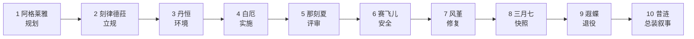
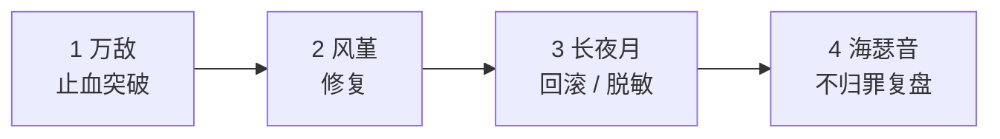

<div align="center">

# 翁法罗斯 Skill 套件

**Amphoreus Skill Suite** — 以《崩坏:星穹铁道》翁法罗斯篇十三位角色为人格外壳的
**13 张工程方法卡 + 1 个总路由**,为 Claude Code / Cursor 的 `.claude/skills` 生态而作。


<br>

**[在线介绍页 →](https://xi-kari.github.io/amphoreus-skill-suite/)** · **[闪卡画廊 →](https://xi-kari.github.io/amphoreus-skill-suite/cards.html)**


<sub>卡面与徽记:「逐火者的命录」系列 · 取自 B 站星穹铁道 Wiki 词条<a href="https://wiki.biligame.com/sr/%E9%80%90%E7%81%AB%E8%80%85%E7%9A%84%E5%91%BD%E8%B7%AF.exe">「逐火者的命路.exe」</a> · 版权归米哈游所有</sub>

</div>

<table><tr>
<td width="88"></td>
<td><b>缇宝 · 命运的三子</b><br><sub>我们十三个,一人一法——每张卡不是聊天人设,而是一套<b>可执行、可验收的工程方法论</b>。往下看啦!</sub></td>
</tr></table>

## 这是什么

- **`SKILL.md`** — 行为契约:方法步骤、话术模板、输出格式、边界与禁区、缺席移交条款,静态可校验;
- **`persona.md`** — 台词与背景参考库:语音条目逐字对齐游戏公开语料(知识库检索复算,字符级冻结检查);
- **风格税 ≤ 15%** — 角色只在极小预算内说话;报错、不可逆操作等严肃场景**自动静音**,方法照常执行;
- **缺席合同** — 流水线上某卡未部署时,报告 `module_unavailable: amphoreus-<hero>` 并保留移交事实包,不代演、不冒充。

## 快速开始

<table><tr>
<td width="88"></td>
<td><b>丹恒 · 掣地的伏龙</b><br><sub>环境与依赖底座,我来承载。三步部署,如下。</sub></td>
</tr></table>

```bash
# 1. 克隆仓库
git clone https://github.com/xi-kari/amphoreus-skill-suite.git && cd amphoreus-skill-suite

# 2. 把 skills/ 下 14 个目录拷入你的技能根
cp -r skills/* ~/.claude/skills/          # Windows: C:\Users\<你>\.claude\skills\

# 3. 校验部署(应输出 PASS,cards=13/13)
python ~/.claude/skills/amphoreus/scripts/validate.py --root ~/.claude/skills --wave all
```

使用:在 Claude Code / Cursor 里直接点名(「用 `amphoreus-mydei` 帮我追这个死锁」),或呼叫 `amphoreus` 总路由,由它按任务深度、角色适配、流水线与风格预算分发。

## 十三卡画廊

与[在线介绍页](https://xi-kari.github.io/amphoreus-skill-suite/)同序陈列(卡序 I–XIII),各卡司职见画廊下方速览表。

<table>
<tr>
<td align="center" width="25%"><br> <b>缇宝</b><br><sub>命运的三子</sub><br><code>amphoreus-tribbie</code><br><sub>I · 三声部讲解法</sub></td>
<td align="center" width="25%"><br> <b>刻律德菈</b><br><sub>执棋的君主</sub><br><code>amphoreus-cerydra</code><br><sub>II · 立法三读</sub></td>
<td align="center" width="25%"><br> <b>三月七 / 长夜月</b><br><sub>隐秘的陌客</sub><br><code>amphoreus-march7th</code><br><sub>III · 拍照式记录法 + 底片法</sub></td>
<td align="center" width="25%"><br> <b>丹恒</b><br><sub>掣地的伏龙</sub><br><code>amphoreus-terrae</code><br><sub>IV · 承载法</sub></td>
</tr>
<tr>
<td align="center" width="25%"><br> <b>海瑟音</b><br><sub>奏浪的剑骑</sub><br><code>amphoreus-hysilens</code><br><sub>V · 歌集复盘法 + 无路引航式</sub></td>
<td align="center" width="25%"><br> <b>风堇</b><br><sub>摇光的医师</sub><br><code>amphoreus-hyacine</code><br><sub>VI · 双处方</sub></td>
<td align="center" width="25%"><br> <b>白厄</b><br><sub>负火的囚徒</sub><br><code>amphoreus-phainon</code><br><sub>VII · 推石法</sub></td>
<td align="center" width="25%"><br> <b>那刻夏</b><br><sub>殁世的学士</sub><br><code>amphoreus-anaxa</code><br><sub>VIII · 五问法 + 删除测试</sub></td>
</tr>
<tr>
<td align="center" width="25%"><br> <b>阿格莱雅</b><br><sub>黄金的织者</sub><br><code>amphoreus-aglaea</code><br><sub>IX · 织造法</sub></td>
<td align="center" width="25%"><br> <b>万敌</b><br><sub>亡国的王储</sub><br><code>amphoreus-mydei</code><br><sub>X · 先让十步法</sub></td>
<td align="center" width="25%"><br> <b>遐蝶</b><br><sub>死荫的侍女</sub><br><code>amphoreus-castorice</code><br><sub>XI · 告别四步</sub></td>
<td align="center" width="25%"><br> <b>赛飞儿</b><br><sub>捷足的羁客</sub><br><code>amphoreus-cipher</code><br><sub>XII · 行窃三则</sub></td>
</tr>
<tr>
<td align="center" width="25%"><br> <b>昔涟</b><br><sub>无瑕的真我</sub><br><code>amphoreus-cyrene</code><br><sub>XIII · 如我所书法</sub></td>
<td align="center" width="25%"><br> <b>开拓者 · 星</b><br><sub>创世的著者</sub></td>
<td align="center" width="25%"><b>amphoreus 总路由</b><br><sub>开拓者「创世的著者」</sub><br><code>amphoreus</code><br><sub>意图识别与分发:<br>深度门 L0 直答 / L1 单卡<br>L2 串卡 / L3 流水线会诊<br>按角色适配与风格预算<br>路由至十三卡,<br>不混声、不代演</sub></td>
<td align="center" width="25%"><br> <b>开拓者 · 穹</b><br><sub>创世的著者</sub></td>
</tr>
</table>

| 卡序 | 方法卡 | 方法 | 司职 |
| :---: | --- | --- | --- |
| I | 缇宝 `amphoreus-tribbie` | 三声部讲解法 | 新手 / 同行 / 专家分声部技术讲解 |
| II | 刻律德菈 `amphoreus-cerydra` | 立法三读 | 有证据、有成本、可评审、可撤销的工程规则 |
| III | 三月七 / 长夜月 `amphoreus-march7th` | 拍照式记录法 + 底片法 | 日志与快照;备份 / 回滚 / 脱敏 |
| IV | 丹恒 `amphoreus-terrae` | 承载法 | 开发环境 / CI 构建 / 依赖底座 / 可逆迁移 |
| V | 海瑟音 `amphoreus-hysilens` | 歌集复盘法 + 无路引航式 | 不归罪复盘 / 痛苦取舍导航 |
| VI | 风堇 `amphoreus-hyacine` | 双处方 | bug 诊断修复 / 依赖故障 / 维护债 |
| VII | 白厄 `amphoreus-phainon` | 推石法 | 大型重构与批量迁移,可计数、可回滚 |
| VIII | 那刻夏 `amphoreus-anaxa` | 五问法 + 删除测试 | 代码 / 设计 / 论证评审 |
| IX | 阿格莱雅 `amphoreus-aglaea` | 织造法 | 项目规划 / 排期 / 取舍 / 里程碑 |
| X | 万敌 `amphoreus-mydei` | 先让十步法 | 硬 bug / 性能瓶颈 / 死锁的有界突破 |
| XI | 遐蝶 `amphoreus-castorice` | 告别四步 | 影响先行的 API / 依赖 / 项目退役 |
| XII | 赛飞儿 `amphoreus-cipher` | 行窃三则 | 授权内对抗测试 / 边界用例 / 私密漏洞报告 |
| XIII | 昔涟 `amphoreus-cyrene` | 如我所书法 | 项目记忆 / 阶段叙事 / 终版总装,逐字不改写 |
| — | 总路由 `amphoreus` | 深度门与分派 | L0 直答 / L1 单卡 / L2 串卡 / L3 流水线会诊 |

## 两条流水线

**逐火线** —— 新特性从规划到入册的十站交付:



**守夜线** —— 事故响应的四站闭环:



<table><tr>
<td width="88"></td>
<td><b>长夜月 · 隐秘的陌客</b><br><sub>事故场景全程静音档;删除、回滚、脱敏、清档由三月七以一句交接语让位于「长夜月」特勤,完成必附底片单,结束后交回。</sub></td>
</tr></table>

## 质量与验收

<table><tr>
<td width="88"></td>
<td><b>那刻夏 · 殁世的学士</b><br><sub>所有结论,先过五问,再过删除测试。以下每个数字都有 docs/ 文书与哈希账背书。</sub></td>
</tr></table>

全家族分四波交付,每波经独立验收核查(多代理盲评 + 交叉复核 + 批判员),全程**失败原样入册、不覆盖不美化**。

| 检验项 | 结果 |
| --- | --- |
| 静态校验 | `validate.py --wave all` PASS:卡 13/13 · 路由清单 17/17 · 评测 13 卷 65 场景 · UTF-8/LF |
| 行为评测 | 每卡 5 题冻结场景,13 卡全部 **60/60**、硬失败 0(失败重跑留痕:昔涟 C-03 首跑真失败,入册后重跑闭合) |
| 台词保真 | 语音总账 **182 条**逐字对齐游戏知识库,引文字符级冻结检查内建于 validator |
| 风格税 | 已记录最高 **13.4%**(红线 ≤ 15%),严肃场景自动静音 |
| 端到端终验 | 逐火线 10 站、守夜线 4 站各演练一次,独立评审 **CONFIRMED** |
| 事后勘误 | L1 缺席断言转运行时条件式(五题重跑 + 三分支探针,双评审 CONFIRMED);L2 旧目录归档后清理;L3 超时审计线核销 |

<details>
<summary><b>验收体系细节</b></summary>
<br>

- **冻结评测**:每卡 5 个场景 + 评分 rubric 在建卡前冻结(哈希钉死),行为跑分由与建卡方隔离的盲评代理执行,再经交叉复核;
- **SHA 纪律**:卡文任何一字变更 → 该卡五题全重跑 + 独立评分 + 交叉复核;
- **知识库保真**:台词经 MCP 知识库逐条复算,分隔符(U+2022)、字符级一致才入账;
- **交付事务**:每波双打包(基线包 / 修改包)+ 逐字节 DIFF + 回滚脚本沙箱重放 + 生产零漂移双算法证明;
- **完整证据链**(誊本、哈希账、评分原文、失败轨迹)存于本地交付树,本仓库收录各波验收单与终验报告(见 <a href="docs/">docs/</a>)。

</details>

## 多智能体适配

<table><tr>
<td width="88"></td>
<td><b>赛飞儿 · 捷足的羁客</b><br><sub>想去别的生态?路线我早踩好点了——十个落点,各有各的门。</sub></td>
</tr></table>

`skills/` 为唯一事实源;`adapters/build.py` 一键生成其他生态的适配文件(详见 [adapters/README](adapters/README.md)):

| 生态 | 文件 |
| --- | --- |
| Claude Code / Cursor(原生,验收环境) | `skills/` 整树 |
| AGENTS.md 系(Codex CLI / OpenCode / Amp / Jules…) | [`adapters/openai-codex/AGENTS.md`](adapters/openai-codex/AGENTS.md) |
| Gemini CLI | [`adapters/gemini-cli/GEMINI.md`](adapters/gemini-cli/GEMINI.md) |
| Cline / Roo Code | [`adapters/cline/amphoreus.md`](adapters/cline/amphoreus.md) |
| GitHub Copilot | [`adapters/github-copilot/copilot-instructions.md`](adapters/github-copilot/copilot-instructions.md) |
| Windsurf(Cascade) | [`adapters/windsurf/amphoreus.md`](adapters/windsurf/amphoreus.md) |
| Aider | [`adapters/aider/CONVENTIONS.md`](adapters/aider/CONVENTIONS.md) |
| Trae | [`adapters/trae/project_rules.md`](adapters/trae/project_rules.md) |
| Qwen Code | [`adapters/qwen-code/QWEN.md`](adapters/qwen-code/QWEN.md) |
| iFlow CLI | [`adapters/iflow-cli/IFLOW.md`](adapters/iflow-cli/IFLOW.md) |
| 任意可加载系统提示的智能体 | [`adapters/generic/`](adapters/generic/) 便携版单卡(卡文+家族公约,单文件自足) |

> 适配层不改写卡文,只做打包与约定壳;60/60、两线终验等行为验收结论仅在 Claude Code 环境取得,其他运行时未在验收范围内。

## 仓库结构

```
├── README.md · CHANGELOG.md · CONTRIBUTING.md · LICENSE
├── index.html                # 在线介绍页(杂志跨页首屏 + 卡面轮播 + 方法卡弹窗 + 十三册陈列)
├── cards.html                # 闪卡画廊(三层互斥分区立体闪卡:正面=原图,倾斜见景深+箔光)
├── .github/                  # CI(validate + 适配零漂移)+ Issue 模板(卡文问题 / 素材下架)
├── assets/
│   ├── cards-full/           # 15 张原尺寸卡面(原字节入库,SHA 校验)
│   ├── cards/                # 400×702 等尺寸缩略卡面(README 画廊 / 介绍页网格共用)
│   ├── symbols/              # 15 枚黄金裔徽记(tools/crop_symbols.py 圆检测重裁)
│   ├── stickers/             # 18 枚官方 Q 版表情包(原字节入库)
│   ├── mag/                  # 《CHRYSOS·黄金裔》杂志素材(13 封面 + 13 组跨页双档)+ 昔涟首屏/闪卡底图
│   └── layers/ · banner.jpg  # 闪卡三层分区素材(背景/前景/徽记 + geo.js 几何单源)· 横幅
├── tools/                    # crop_symbols.py(徽记圆检测)· make_layers.py(闪卡分层管线,逐卡断言)
├── skills/                   # 14 目录 43 文件 = 总路由 + 13 卡(生产验收态,唯一事实源)
│   ├── amphoreus/            #   路由 SKILL + references/common.md + evals/(13 卷)+ scripts/validate.py
│   └── amphoreus-<hero>/     #   各卡 SKILL.md + persona.md
├── adapters/                 # build.py 生成:九个生态的约定文件 + 通用便携单卡
└── docs/                     # 总任务书 · 设计分册 · 波1–4验收单 · 终验报告 · 哈希总账
```

## 维护与迭代

<table><tr>
<td width="88"></td>
<td><b>风堇 · 摇光的医师</b><br><sub>定期体检:每次推 main 与每个 PR,CI 都会跑静态校验和适配层零漂移检查;改卡请按 SHA 纪律复诊。</sub></td>
</tr></table>

- **改卡**:卡文一字变更 → 该卡五题冻结评测全重跑 + 独立评分 + 交叉复核,流程见 [CONTRIBUTING.md](CONTRIBUTING.md);
- **改适配**:只改 `adapters/build.py` 后重跑,勿手改生成物(CI 会拦);
- **改介绍页**:展示顺序由 `index.html` 内 `ORDER` 数组唯一决定;验收数字须与 `docs/` 一致;
- **版本**:语义化版本,见 [CHANGELOG.md](CHANGELOG.md)。

## 文档索引

| 文档 | 内容 |
| --- | --- |
| [总任务书](docs/总任务书.md) · [设计分册](docs/设计分册/) | 套件总纲与十三卡逐卡设计 |
| [波1](docs/波1验收单.md) · [波2](docs/波2验收单.md) · [波3](docs/波3验收单.md) · [波4](docs/波4验收单.md) 验收单 | 各波交付、失败轨迹与遗留处置 |
| [十三卡终验报告](docs/十三卡终验报告.md) | 两线端到端演练与家族收官判定 |
| [VERIFICATION-波4](docs/VERIFICATION-波4.txt) | 哈希总账:制品 SHA、reopen 与勘误追记 |
| [波4终验总报告](docs/波4终验总报告.md) | 面向委托人的收官叙述(含「老实说的失败」) |
| [CHANGELOG](CHANGELOG.md) · [CONTRIBUTING](CONTRIBUTING.md) | 版本历史 · 维护手册(SHA 纪律 / 素材管线 / 发布流程) |

## 声明

本仓库为爱好者研究 / 学习用途的同人衍生内容,与米哈游无关联。《崩坏:星穹铁道》及全部角色、立绘、台词素材版权归米哈游(HoYoverse)所有;卡面与徽记图片取自 [B 站星穹铁道 Wiki](https://wiki.biligame.com/sr/),角色 Q 版表情包素材版权同归米哈游,台词经公开 Wiki 语料逐字核对。本页与介绍页中的角色气泡台词为贴合各卡话术契约的**风格创作,非游戏原句**。[LICENSE](LICENSE)(MIT)仅覆盖本仓库原创代码与文档,不覆盖上述素材;如有侵权,请用 [Issue 模板「素材版权 / 下架请求」](.github/ISSUE_TEMPLATE/02-takedown.md)联系删除。

<div align="center">
<br>
<br>
<sub><b>昔涟</b>:这一册讲完了。下一页,由你来写♪</sub>
<br><br>
<sub>火种在此传递。</sub>
</div>
